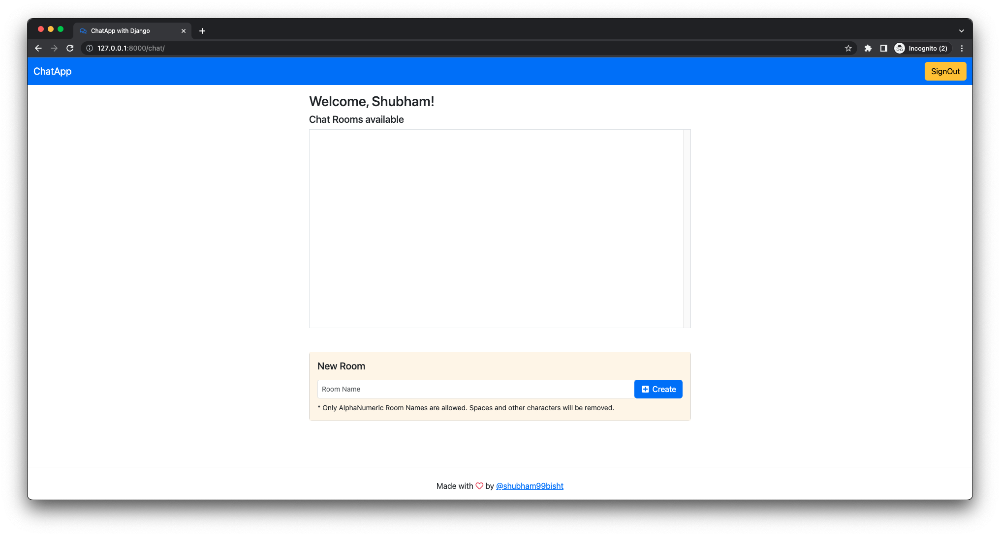
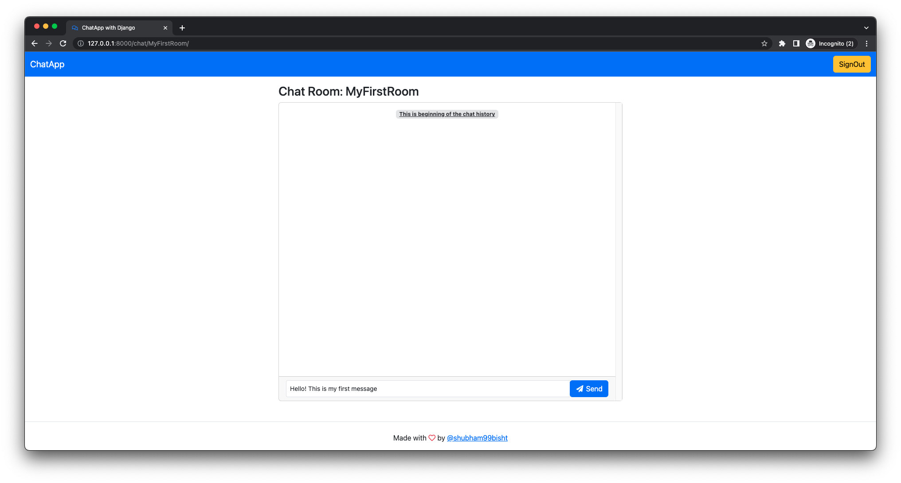
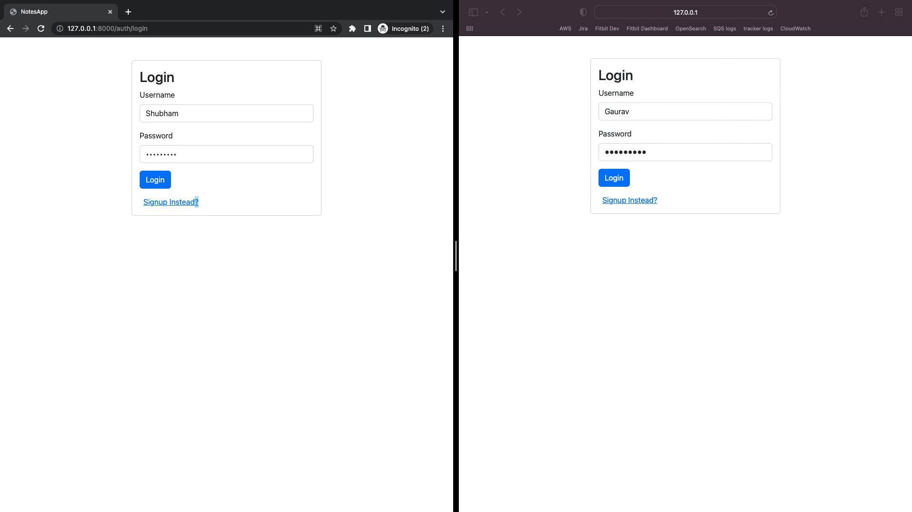
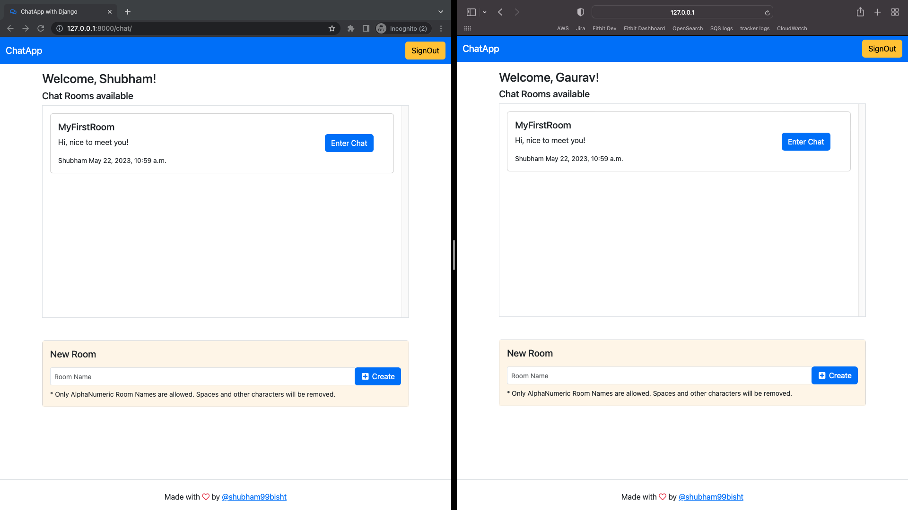
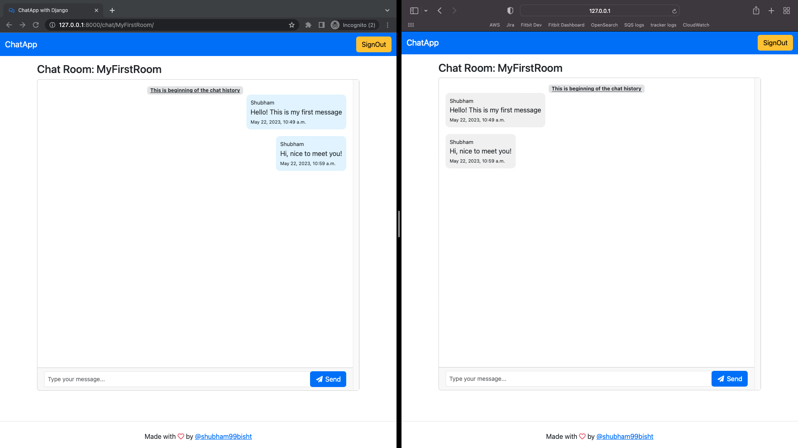
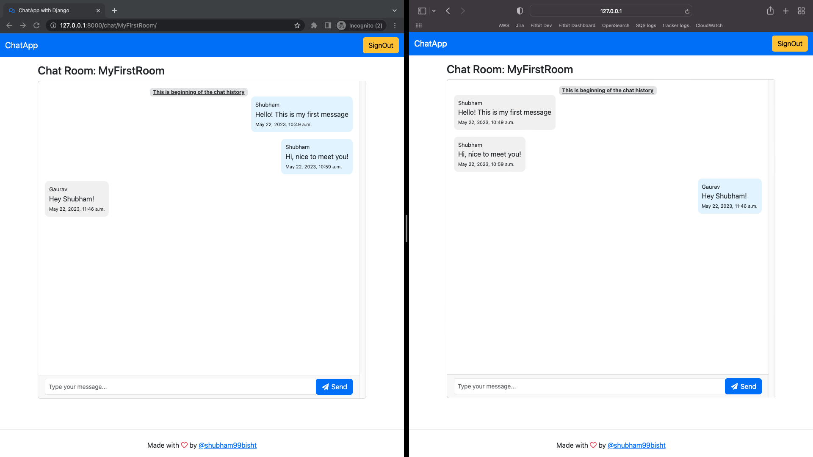
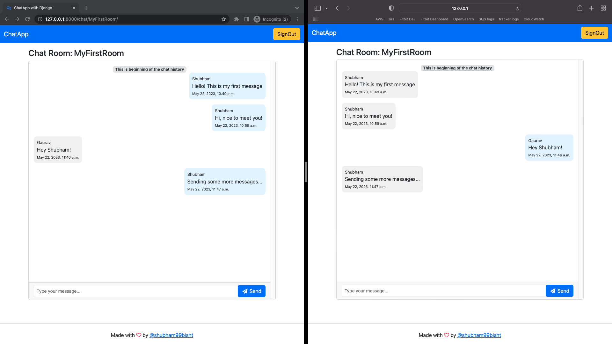
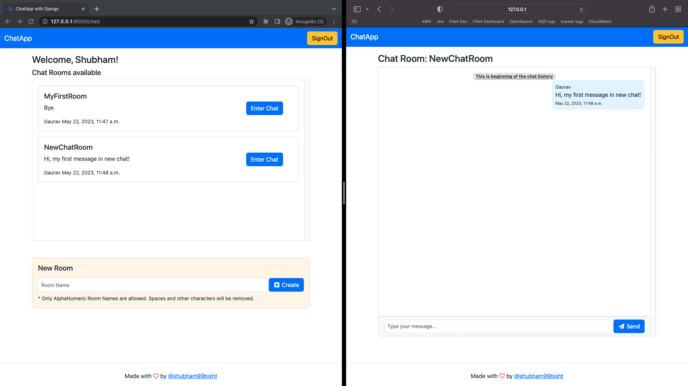

# Chat App
Chat Room app using Django WebSockets and Bootstrap


## Project Setup

1. Create virtual env using `python3 -m venv venv`
2. After activating virtual env, install dependencies using `pip install -Ur requirements.txt`
3. Change directory to root folder and perform DB migrations
```
    python manage.py makemigrations
    python manage.py migrate
```
4. Start server using `python manage.py runserver`

## Functionality

- Log in
    - via username & password
- Create an account
- Create new chat rooms
- Send new chat messages over web sockets
- Retrieve Chat Rooms and Message history from DB CRUD operations

## Screenshots

| Welcome | Empty Chat |
| -------|--------------|
|  |  |

| Log In | Home Screen | ChatRoom Screen |
| ---------------|------------------|-----------------|
|  |  |  |

| New Message | More new message | New Chat Room |
| ---------------|------------------|-----------------|
|  |  |  |
